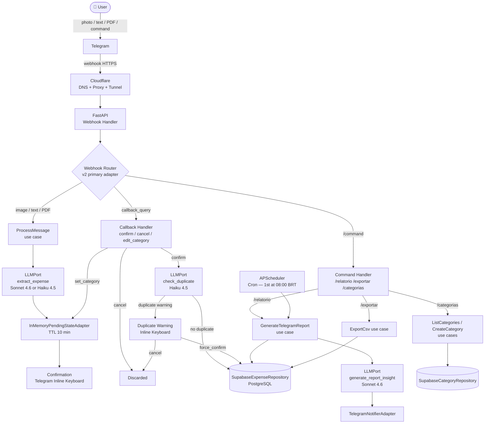
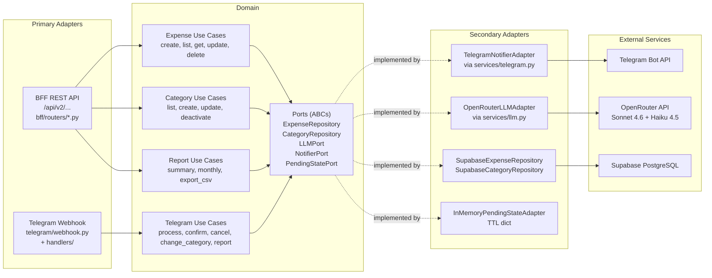
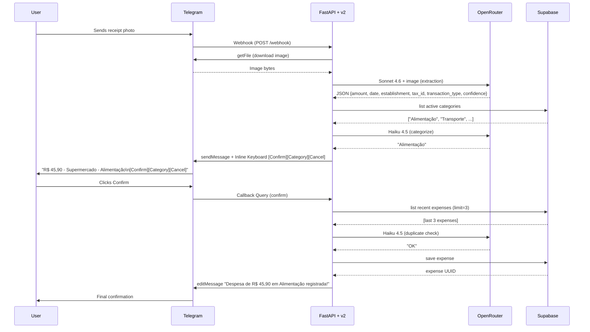

# Architecture Diagram — Personal Finances

## Main Flow (Telegram Bot)



## Hexagonal Architecture — Component View



## Sequence — Expense Registration (Image)



## Inline Keyboards

### Confirmation (after extraction)
```
[ ✅ Confirm ] [ ✏️ Category ] [ ❌ Cancel ]
```

### Duplicate Warning
```
[ 💾 Save anyway ] [ ❌ Cancel ]
```

### Category Selection (after clicking "Category")
```
[ Alimentação  ] [ Transporte ]
[ Moradia      ] [ Saúde      ]
[ Educação     ] [ Lazer      ]
[ Vestuário    ] [ Serviços   ]
[ Pets         ] [ Outros     ]
```
*(plus any custom categories added by the user)*
