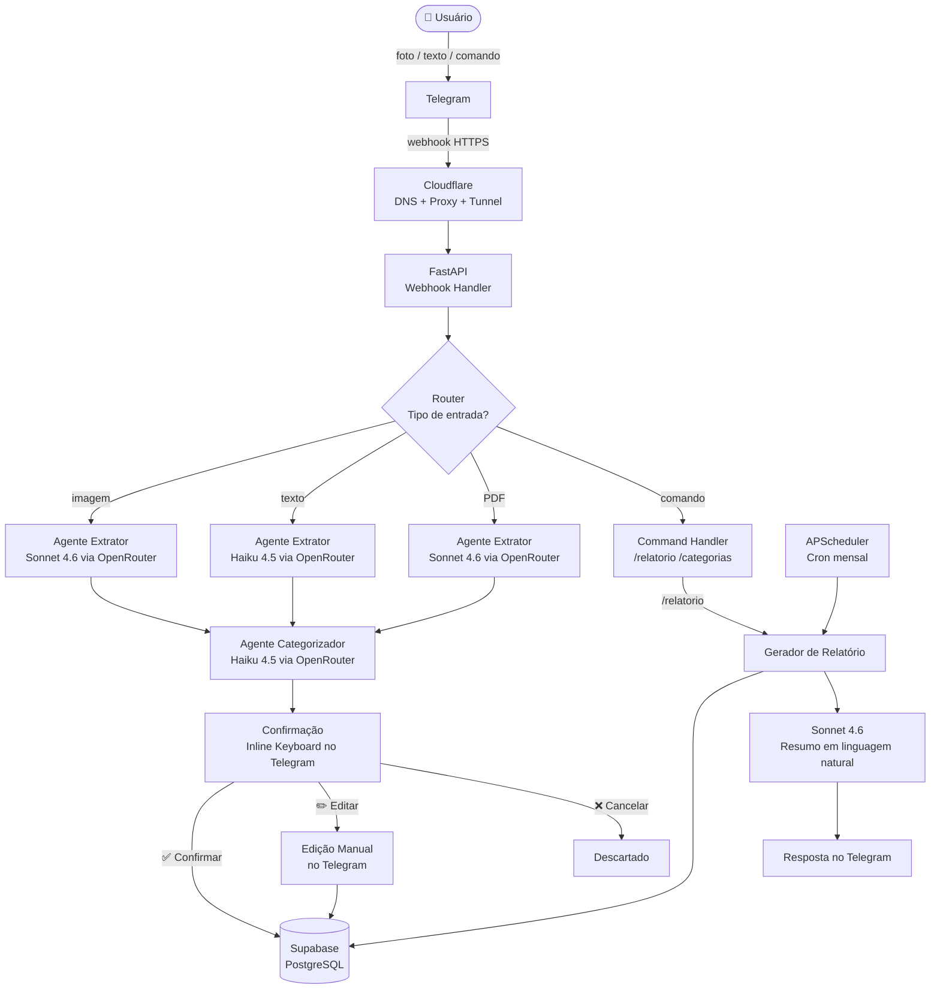
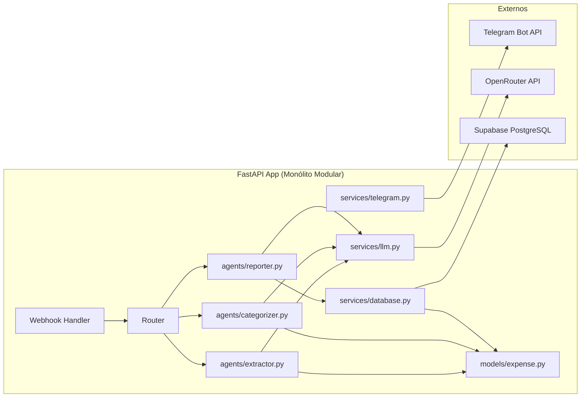
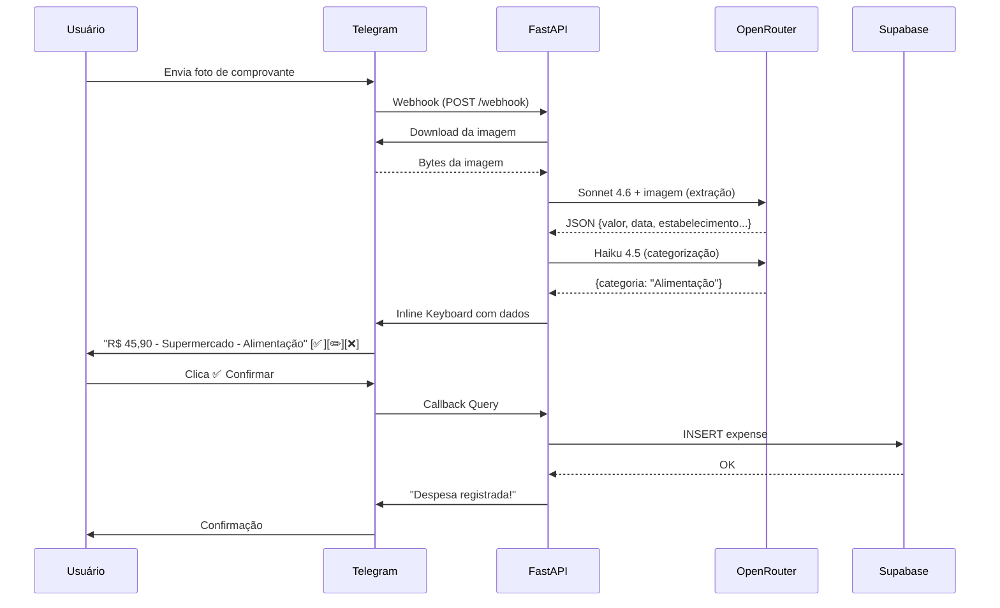

# Diagrama de Arquitetura — FinBot

## Fluxo Principal

```mermaid
flowchart TD
    User([👤 Usuário]) -->|foto / texto / comando| TG[Telegram]
    TG -->|webhook HTTPS| CF[Cloudflare\nDNS + Proxy + Tunnel]
    CF --> API[FastAPI\nWebhook Handler]
    
    API --> Router{Router\nTipo de entrada?}
    
    Router -->|imagem| EXT_IMG[Agente Extrator\nSonnet 4.6 via OpenRouter]
    Router -->|texto| EXT_TXT[Agente Extrator\nHaiku 4.5 via OpenRouter]
    Router -->|PDF| EXT_PDF[Agente Extrator\nSonnet 4.6 via OpenRouter]
    Router -->|comando| CMD[Command Handler\n/relatorio /categorias]
    
    EXT_IMG --> CAT[Agente Categorizador\nHaiku 4.5 via OpenRouter]
    EXT_TXT --> CAT
    EXT_PDF --> CAT
    
    CAT --> CONFIRM[Confirmação\nInline Keyboard no Telegram]
    CONFIRM -->|✅ Confirmar| DB[(Supabase\nPostgreSQL)]
    CONFIRM -->|✏️ Editar| EDIT[Edição Manual\nno Telegram]
    CONFIRM -->|❌ Cancelar| DISCARD[Descartado]
    EDIT --> DB
    
    CMD -->|/relatorio| RPT[Gerador de Relatório]
    RPT --> DB
    RPT --> LLM_RPT[Sonnet 4.6\nResumo em linguagem natural]
    LLM_RPT --> TG_OUT[Resposta no Telegram]
    
    SCHED[APScheduler\nCron mensal] --> RPT
```

## Visão de Componentes

```mermaid
graph LR
    subgraph "FastAPI App (Monólito Modular)"
        WH[Webhook Handler]
        RT[Router]
        AG_E[agents/extractor.py]
        AG_C[agents/categorizer.py]
        AG_R[agents/reporter.py]
        SVC_T[services/telegram.py]
        SVC_L[services/llm.py]
        SVC_D[services/database.py]
        MDL[models/expense.py]
    end
    
    subgraph "Externos"
        TG_API[Telegram Bot API]
        OR_API[OpenRouter API]
        SB_API[Supabase PostgreSQL]
    end
    
    WH --> RT
    RT --> AG_E
    RT --> AG_C
    RT --> AG_R
    AG_E --> SVC_L
    AG_C --> SVC_L
    AG_R --> SVC_L
    AG_R --> SVC_D
    SVC_L --> OR_API
    SVC_D --> SB_API
    SVC_T --> TG_API
    AG_E --> MDL
    AG_C --> MDL
    SVC_D --> MDL
```

## Fluxo de Dados

```mermaid
sequenceDiagram
    participant U as Usuário
    participant T as Telegram
    participant F as FastAPI
    participant OR as OpenRouter
    participant DB as Supabase

    U->>T: Envia foto de comprovante
    T->>F: Webhook (POST /webhook)
    F->>T: Download da imagem
    T-->>F: Bytes da imagem
    F->>OR: Sonnet 4.6 + imagem (extração)
    OR-->>F: JSON {valor, data, estabelecimento...}
    F->>OR: Haiku 4.5 (categorização)
    OR-->>F: {categoria: "Alimentação"}
    F->>T: Inline Keyboard com dados
    T->>U: "R$ 45,90 - Supermercado - Alimentação" [✅][✏️][❌]
    U->>T: Clica ✅ Confirmar
    T->>F: Callback Query
    F->>DB: INSERT expense
    DB-->>F: OK
    F->>T: "Despesa registrada!"
    T->>U: Confirmação
```
