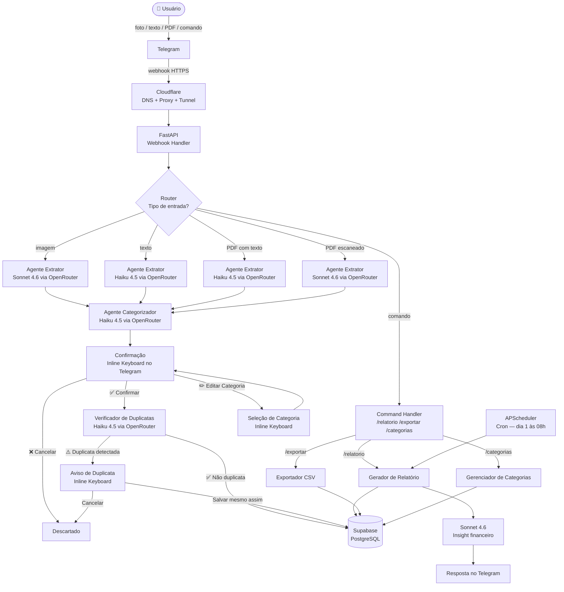
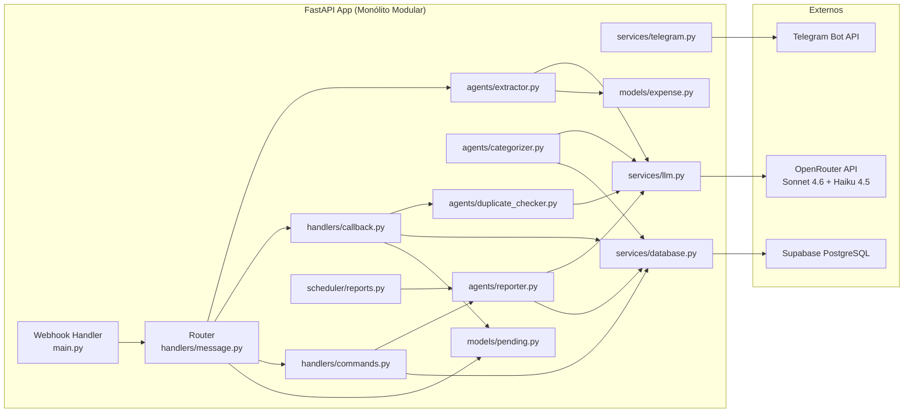
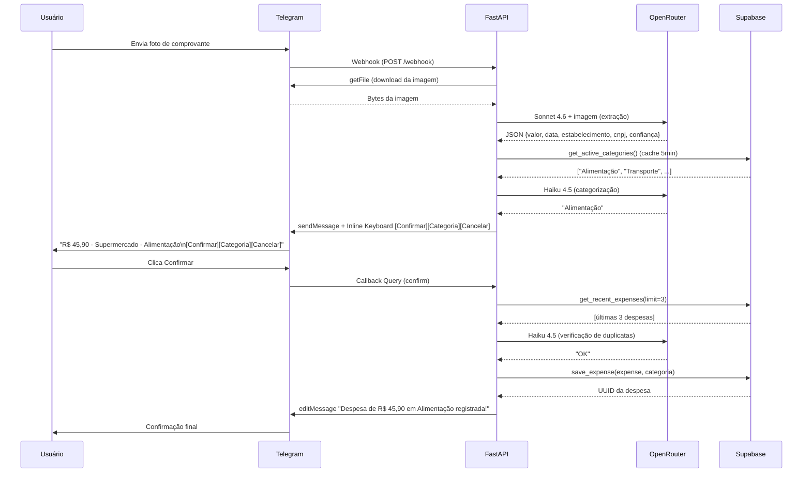

# Diagrama de Arquitetura — FinBot

## Fluxo Principal



## Visão de Componentes



## Fluxo de Dados — Registro de Despesa (Imagem)



## Inline Keyboards

### Confirmação (após extração)
```
[ Confirmar ] [ Categoria ] [ Cancelar ]
```

### Aviso de Duplicata (após detect)
```
[ Salvar mesmo assim ] [ Cancelar ]
```

### Seleção de Categoria (ao clicar "Categoria")
```
[ Alimentação  ] [ Transporte ]
[ Moradia      ] [ Saúde      ]
[ Educação     ] [ Lazer      ]
[ Vestuário    ] [ Serviços   ]
[ Pets         ] [ Outros     ]
```
*(mais categorias customizadas adicionadas pelo usuário)*
